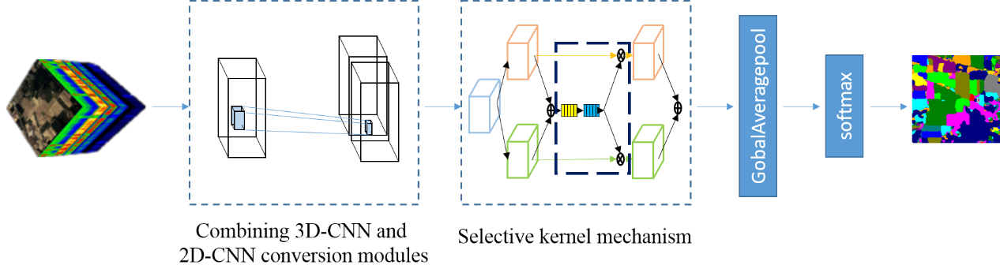
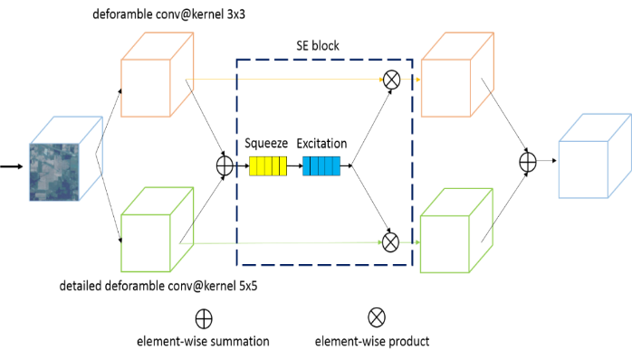

# Implementation of Faster hyperspectral image classification based on selective kernel mechanism using deep convolutional networks

This is a tensorflow and keras based implementation of FSKNet for HSI 

  

Combining 3D-CNN and 2D-CNN conversion module

  

Selective kernel mechanism

  

arixv：https://arxiv.org/abs/2202.06458
